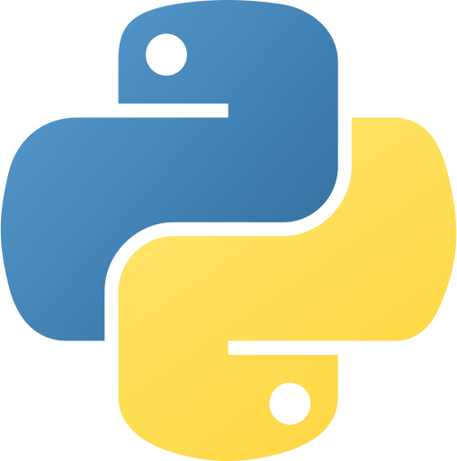

```python
def about_me():
  name = "Lara"
  homebase = "Berlin, Germany"
  current_role =  "Software Engineering Student"
  years_in_qorkforce = "+ 5 years in Tech companies"
  former_education = "Bachelor of B.A."
  my_story = """ 
  Software engineering student and co-organiser of the DjangoUserGroup Berlin. I'm excited about Python, Django projects, and anything around test automation.
  I want to become good at breaking software to make it safer, robust, and efficient for the business and the user.
  My background in people management has provided me with valuable experience in problem-solving and business strategy. 

  I'm documenting parts of my developer journey on my blog.

  ‘Not knowing when the Dawn will come, I open every Door’ by Emily Dickinson'
   """

if __name__ == "__main__":
    about_me(),
    print("Open to, part-time work!")

```

<h2 align="center">  </h2> 
<p align="center">
<a>
<a>
<a>
<a>
<a>
<a>
<a>
<a>
<a>
<a>

<br>
<p align="center">
<a>
